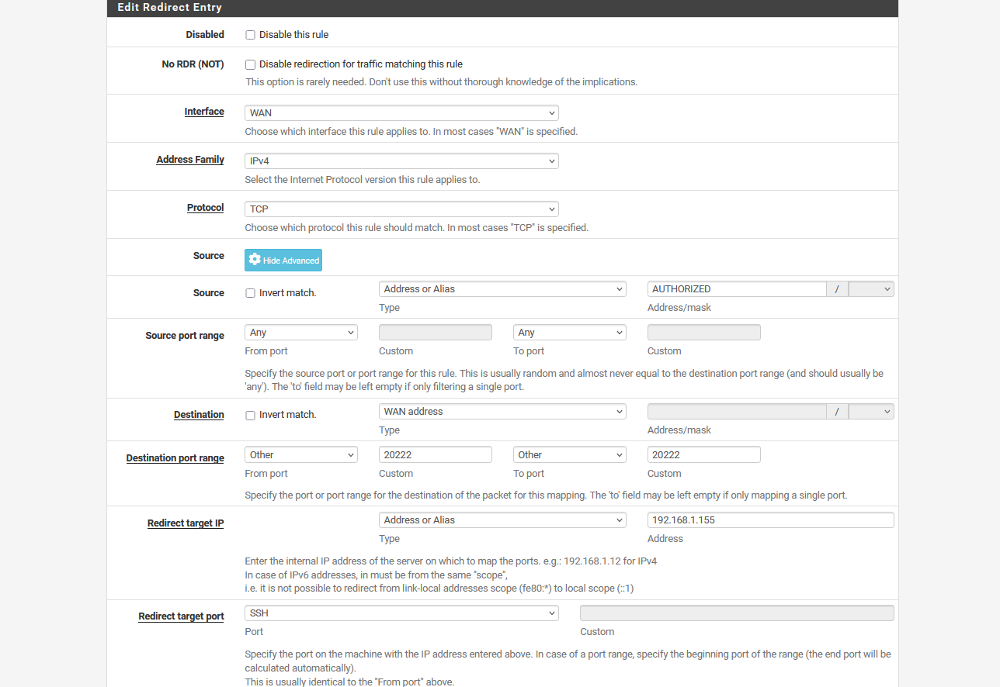
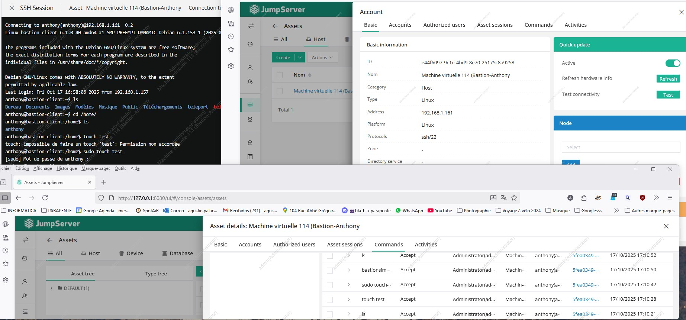

# Brief : "Mise en place d'un bastion pour votre infrastructure"

### Contexte du projet : "En tant que administrateur réseau, administrer déployer un bastion pour donner accès aux ressources de l'entreprise aux utilisateurs en mobilité et aux partenaires."

## Etude comparative des solutions de Bastion

 
  
  | Nom | Licence | Gratuit / Commercial | Description | Points forts | Maintenance | Facilité d’installation | Taille de déploiement | Lien / Référence |
  |---|---|---|---|---|---|---|---|---|
  | **Teleport** | Apache-2.0 | Usage libre ; certaines fonctionnalités avancées payantes pour entreprise | Plateforme moderne et scalable pour SSH, Kubernetes, bases de données et applications internes | Enregistrement des sessions, audit complet | Très active | Moyenne à complexe | Moyen à grand | [GitHub](https://github.com/gravitational/teleport) |
  | **JumpServer** | GPL-3.0 | Totalement libre | Plateforme complète de gestion des accès privilégiés pour SSH, RDP, bases de données, etc. | Accès web, enregistrement des sessions, multi-protocoles | Très active | Moyenne | Moyen à grand | [GitHub](https://github.com/jumpserver/jumpserver) |
  | **Guacamole** | Apache-2.0 | Totalement libre | Gateway web pour accéder à distance aux bureaux et serveurs via RDP, SSH, etc | Accès web sans client, multi-protocoles, support mobile | Très active | Moyenne | Petit à moyen | [GitHub](https://github.com/apache/guacamole-client) |
  | **Bastillion** | Prosperity Public License | Gratuit pour usage interne ; restrictions pour usage commercial | Console SSH web centralisée pour gérer l’accès administratif aux serveurs | Gestion des clés, audit, enregistrement des sessions | Active | Facile | Petit à moyen | [Site officiel](https://www.bastillion.io/) |
  | **Warpgate** | Apache-2.0 | Totalement libre | Bastion moderne SSH et HTTPS, simple et sécurisé | SSH/HTTPS, interface web, 2FA/SSO, audit | Active | Facile | Petit à moyen | [GitHub](https://github.com/warp-tech/warpgate) |
  | **The Bastion (OVH)** | Apache-2.0 | Usage libre | Authentification, autorisation, traçabilité et audit des accès SSH | API JSON, intégration systèmes RH | Modérément active | Moyenne | Petit à moyen | [GitHub](https://github.com/ovh/the-bastion) |
  | **OneTerm** | Open Source | Totalement libre | Bastion web open source, basé sur les principes 4A (Auth, Autorisation, Account, Audit) | Authentification unifiée, audit complet | Moins active | Facile | Petit | [Article Medium](https://medium.com/@song.lhlh/oneterm-the-open-source-bastion-host-i-refactored-in-three-months-576e82b24b66) |

## Choix pour le project:

- ### "JumpServer"
	
    **Pour la mise en place d'un bastion j'ai choisi JumpServer. Voici quelques point à surligner qui justifient mon choix :**
	    
	- Licence GPL-3.0, totalement libre. Depo GitHub maintenu à jour et avec une bonne reputation : https://github.com/jumpserver/jumpserver.

	- Plateforme complète de gestion des accès privilégiés (PAM) pour SSH, RDP, Kubernetes, bases de données, etc.

	- Accès web, enregistrement des sessions, RBAC, multi-protocoles.  
	  
    - Maintenance est Très active.
	  
    - Facilité d'installation.  
	  
    - Taille de déploiement.

	- Plusieurs entreprises que je connais l'utilisent : Decathlon, ASUS, Siemens Lenovo, etc.
	
    - JumpServer Community Edition est gratuite et parfaitement adaptée à un usage en laboratoire scolaire ou dans un environnement éducatif.
	
    - Gestion des accès SSH, RDP, Kubernetes, bases de données et applications distantes via une interface web.
	
    - Enregistrement des sessions, audit détaillé, contrôle d’accès basé sur les rôles (RBAC).
	
    - Installation simple via un script bash ou Docker.

## Infrastructure pour la mise en place du bastion:

    - Hyperviseur : Proxmox de l'école.
    
    - Host : PC Personnel (Connexion vers le Bastion en tunnel SSH)
    
    - VM : 106 (BastionAPalacios) - PC ou le bastion a été installé.
    
    - Ressource : Machine virtuelle 114 (Bastion-Anthony) - Joue le rol d'une machine à protéger derrière un bastion.

# Captures d’écrans :

## Réglés NAT pour acceder depuis mon Host (PC Personnel) à l'Hyperviseur de l'école :

## Ajout d'un nouveau utilisateur

## **JumpServer** en train de tourner :
 - Connexion en SSH à la ressource.
 - Details de la ressource.
 - Historique de commandes.

## Details du compte de la ressource :

## Connexion RDP à la ressource :

